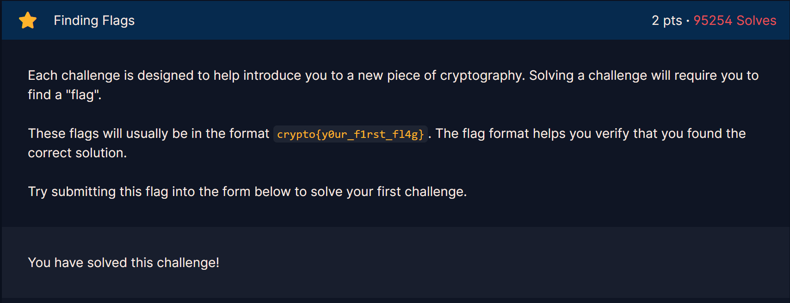

## Challenge 1
> Finding FLags

---

The first challenge is showning the basics of what is a flag, and its format so that I can identify that what I will find is correct.

---
[Next Challenge →](Challenge2.md)
