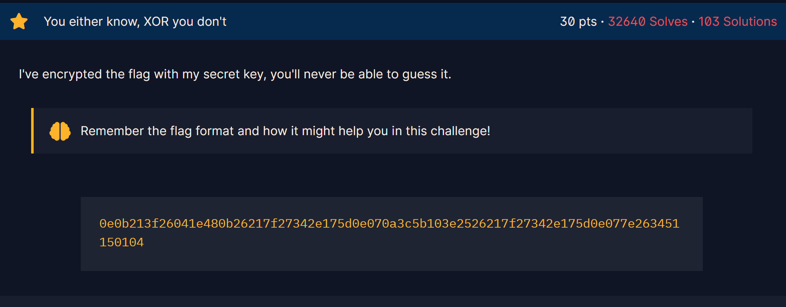

## Challenge 10

> XOR last challenge

---

# 📝 Single-Byte XOR Challenge Write-Up

**Challenge:**
A hex-encoded string was XOR’d with a **single byte key**. Our goal was to recover the original message / flag.

**Approach:**

1. Convert the hex string to bytes.
2. Brute-force all 256 possible single-byte keys.
3. XOR each byte with the key.
4. Decode the result to find readable text containing the flag.

**Tools Used:** Python, pwntools (`xor` function)

**Key Concept:**
Single-byte XOR is **reversible**. Brute force works because the key space is small (0–255).

---

here is the code I made for this challenge: 
[Open Challenge 7 code](Resources/chall9.py)

the flag is:
>crypto{0x10_15_my_f4v0ur173_by7e}

and the key is **16**

[← Previous Challenge](Challenge8.md) | [Next Challenge →](Challenge10.md)