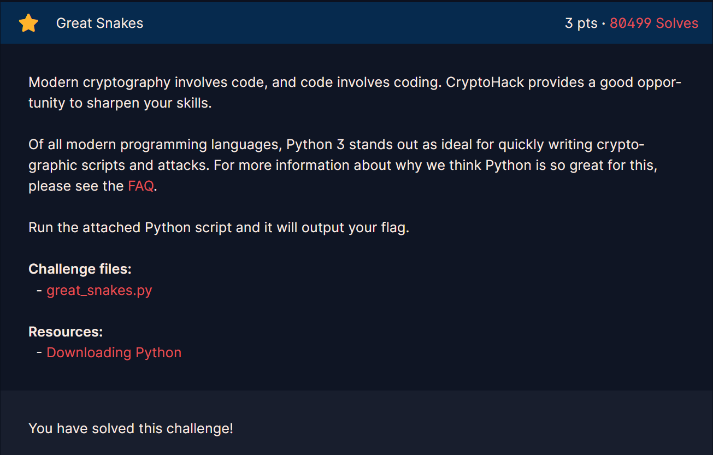

### Challenge 1
> Finding FLags

---

The Second Challenge states that Python really stands out for cryptographic scripts and attacks, then gives us a file named ["great_snakes.py"](Resources\great_snakes_35381fca29d68d8f3f25c9fa0a9026fb.py) 

the file contains a python code which when is run gives us the flag. To further dig down this code, I'll try to explain the details of this code.

1. **Starting with the given Integers** inside the list "ords"
    > ords = [81, 64, 75, 66, 70, 93, 73, 72, 1, 92, 109, 2, 84, 109, 66, 75, 70, 90, 2, 92, 79]

2. **XOR'ing** each integer using **o ^ 0x32** for each o in the list.

3. **Converting it to character**, the output of the XOR are still integers so that is why it is needed to be converted to character in order for it to be read.

4. **Joining into String** , in order to connect all the characters in order to form the flag.          
Result: **crypto{z3n_0f_pyth0n}**

---

[← Previous Challenge](Challenge1.md) | [Next Challenge →](Challenge3.md)
