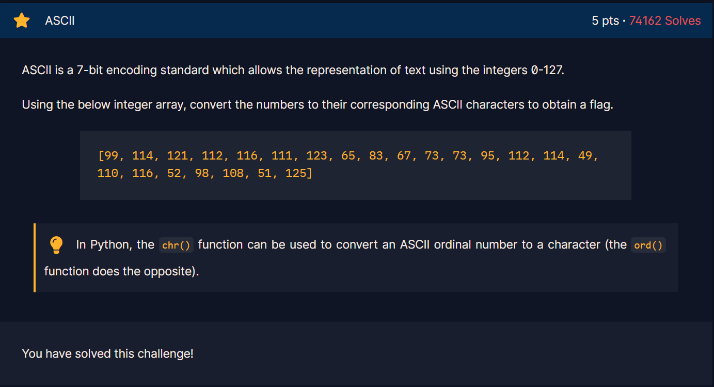

## Challenge 3
> ASCII

---

In this challenge we are given an array which is also the values of ASCII alphabet. using the array we have to encode it to characters in order for us to get the flag.

So what I did in this challenge was that I based my code from the code given in Challenge 2 [great_snakes.py](Resources/great_snakes_35381fca29d68d8f3f25c9fa0a9026fb.py). Converting the ASCII values into character using chr()

[CHALLENGE 3 CODE](Resources/chall3.py)

---

[← Previous Challenge](Challenge2.md) | [Next Challenge →](Challenge4.md)