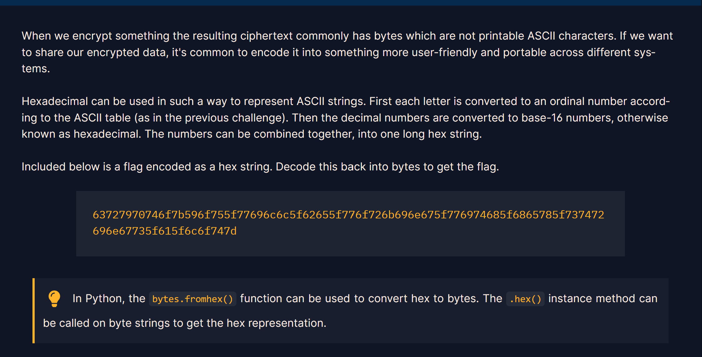

## Challenge 4

> HEX

---

In this challenge we are told that Hexadecimal can be used for data represntation for ACII strings. so each letter has a assinged number (decimal), then this number is converted to base -16 or Hex.

using the tip, we can call the function **bytes.fromhex()** to convert the string to hex.

here is the code I made for this challenge: 
[Open Challenge 4 code](Resources/chall4.py)

resources:  
[ASCII table](https://www.rapidtables.com/code/text/ascii-table.html)
