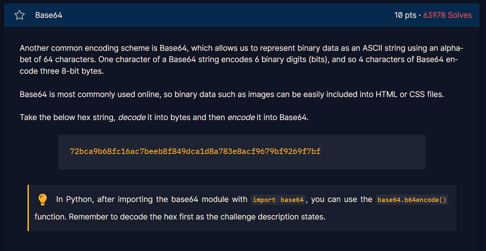

## Challenge 5

> Base64

---

In this challenge we are given a string and in order to get the flag we have to, first decode it into bytes then encode it into base64

using the tip, we can import base64 and then use **base64.b64encode()** to encode the string to base64.

here is the code I made for this challenge: 
[Open Challenge 5 code](Resources/chall5.py)

the flag is:
>crypto/Base+64+Encoding+is+Web+Safe/

[← Previous Challenge](Challenge4.md) | [Next Challenge →](Challenge6.md)