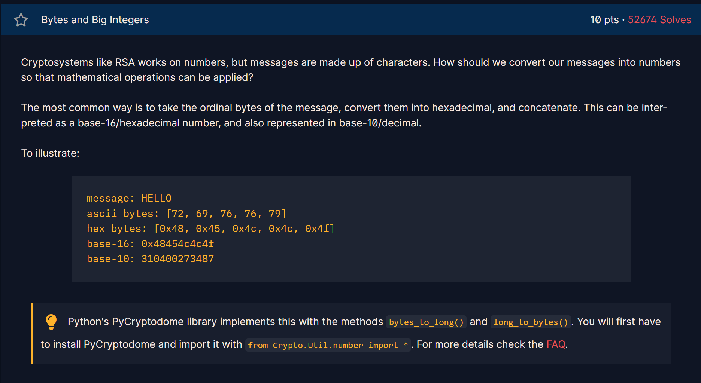

## Challenge 6

>🔐 Encoding Messages as Integers (RSA Preprocessing)




---

## 📌 Challenge Summary

RSA (Rivest–Shamir–Adleman) is a public-key cryptosystem used for:
-Secure communication
-Digital signatures
-Key exchange

Cryptosystems like RSA operate on **integers**, but messages are made of **characters**.

The challenge asks us to convert a large integer back into its original message.

Given integer:

```
11515195063862318899931685488813747395775516287289682636499965282714637259206269
```

---

## 🧠 Key Concept

RSA cannot encrypt text directly.

Before encryption:

```
Text → Bytes → Hex → Big Integer
```

After decryption:

```
Big Integer → Hex → Bytes → Text
```

This challenge tests understanding of that encoding/decoding process.

---

## 🔍 Understanding the Conversion Process

Example from problem:

```
HELLO
↓
ASCII bytes: [72, 69, 76, 76, 79]
↓
Hex bytes: [0x48, 0x45, 0x4c, 0x4c, 0x4f]
↓
Base-16: 0x48454c4c4f
↓
Base-10: 310400273487
```

So the large integer is simply a base-10 representation of concatenated hex bytes.

---
## 📚 What I Learned

* RSA operates on integers, not text.
* Text must be encoded before encryption.
* `bytes_to_long()` and `long_to_bytes()` are inverse functions.
* Encoding is a critical part of cryptographic systems.

---

here is the code I made for this challenge: 
[Open Challenge 6 code](Resources/chall6.py)

the flag is:
>crypto{3nc0d1n6_4ll_7h3_w4y_d0wn}

[← Previous Challenge](Challenge5.md) | [Next Challenge →](Challenge7.md)