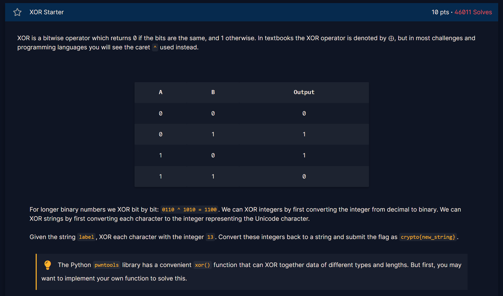

## Challenge 7

> XOR Chain




---

## 📌 Challenge Summary

In the previous XOR challenge, we learned how to:

* XOR each character of a string with a fixed number
* Use Python or pwntools to reverse simple XOR operations
* Understand that XOR is reversible (`A ⊕ A = 0`)

This challenge builds on that by **undoing a chain of XOR operations** involving multiple keys.

---

## 🔑 Key Concept

The solution relies on the **fundamental properties of XOR**:

1. **Commutative:** `A ⊕ B = B ⊕ A` → order doesn’t matter
2. **Associative:** `A ⊕ (B ⊕ C) = (A ⊕ B) ⊕ C` → can group arbitrarily
3. **Identity:** `A ⊕ 0 = A` → XOR with zero leaves the value unchanged
4. **Self-Inverse:** `A ⊕ A = 0` → XORing a value with itself cancels it

Using these properties, we can **recover individual keys** and then the FLAG.

---

## 🔍 What Happened

1. We were given:

```text id="6ylp01"
KEY1
KEY2 ^ KEY1
KEY2 ^ KEY3
FLAG ^ KEY1 ^ KEY2 ^ KEY3
```

2. Recover individual keys:

```text id="jc2tq0"
KEY2 = (KEY2 ^ KEY1) ^ KEY1
KEY3 = (KEY2 ^ KEY3) ^ KEY2
```

3. Recover FLAG by XORing the final value with all three keys:

```text id="79akgs"
FLAG = (FLAG ^ KEY1 ^ KEY2 ^ KEY3) ^ KEY1 ^ KEY2 ^ KEY3
```

4. Hex values were converted to **bytes** before applying XOR.

---

## 🎯 Flag

```text id="98vlnq"
crypto{…}
```

---

## 📚 Takeaways

* XOR is **reversible**, commutative, and associative—making it easy to undo chains.
* Hex → bytes conversion is required for XOR operations in Python.
* Understanding XOR chains is **foundational for cryptanalysis** and attacks on stream ciphers and block cipher modes.

---

here is the code I made for this challenge: 
[Open Challenge 7 code](Resources/chall7.py)

the flag is:
>crypto{aloha}

[← Previous Challenge](Challenge6.md) | [Next Challenge →](Challenge8.md)