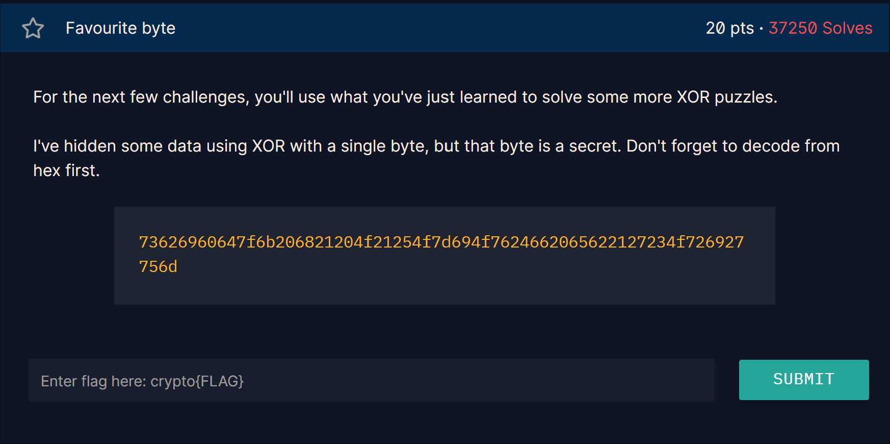

## Challenge 9

>XOR flag with secret key

---

**Challenge:**
A encrypted flag with a **secret key**. Our goal was to find the key and decrypt the message using xor with the key.

**Approach:**

1. Try things out, like XOR'ing "crypto{"
2. After trying this the output was 
**myXORke+y_Q\x0bHOMe$~seG8bGURN\x04DFWga|\x1dTM!an\x7f**
3. After seeing this we can see the first starts with myXORke+y so we use this as a hint for they kay
4. The key should not have any numbers. so we remove the + leaving with "myXORkey"
5. After trying the myXORkey the flag was shown then.

**Key Concept:**
finding out the key with the format of the flag we get the key.

---

here is the code I made for this challenge: 
[Open Challenge 10 code](Resources/chall10.py)

the flag is:
>crypto{1f_y0u_Kn0w_En0uGH_y0u_Kn0w_1t_4ll}

and the key is **myXORkey**

[← Previous Challenge](Challenge9.md) | [Next Challenge →](Challenge10.md)